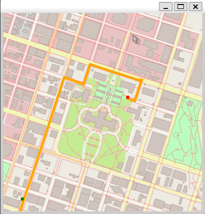

# Route Planner

This project implements a route planner that finds the shortest path between two points on a map using the A* search
algorithm. It uses mapping data from OpenStreetMap.

---



## How to Run:

```bash
cd route-planner
mkdir build && cd build
cmake -DCMAKE_BUILD_TYPE=Release ..
make
./OSM_A_star_search
```
